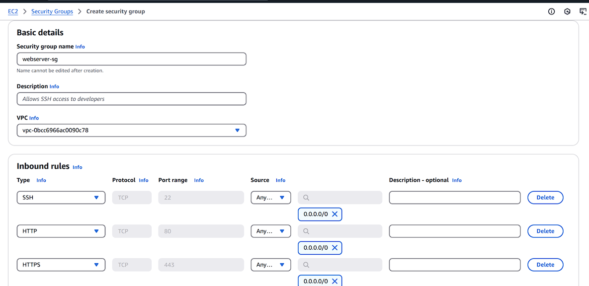
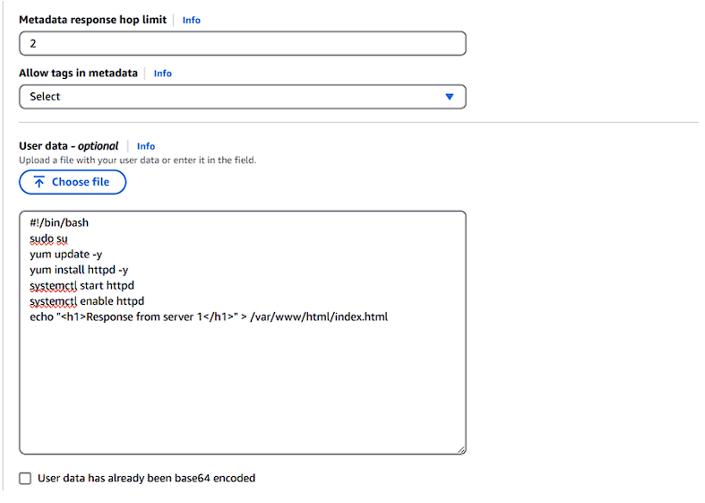
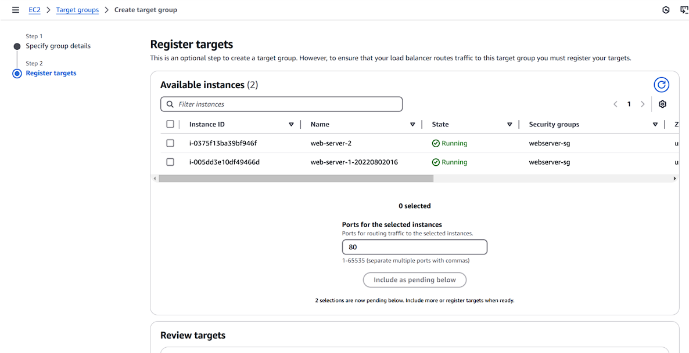
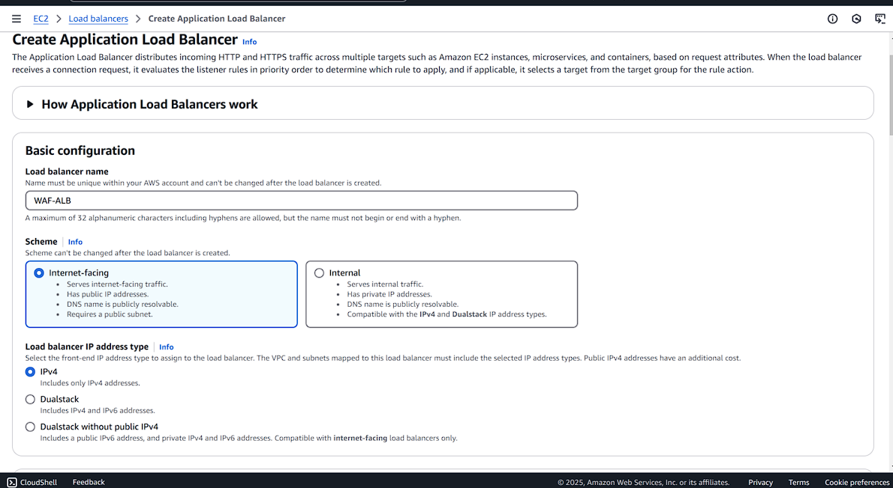
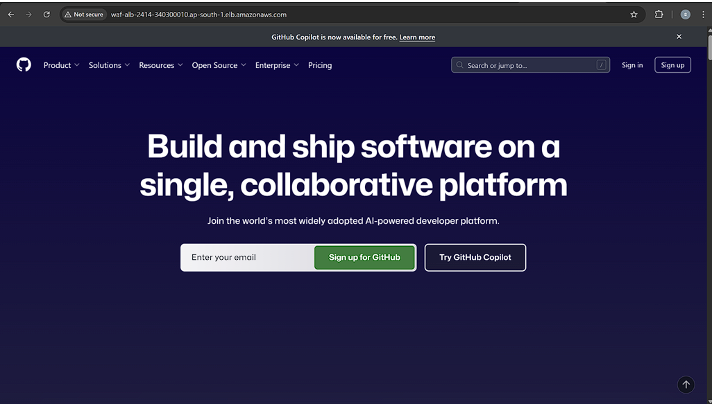
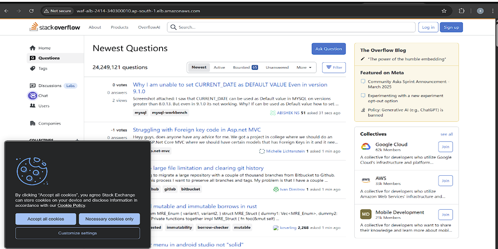
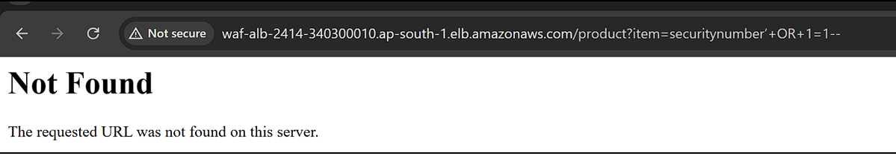
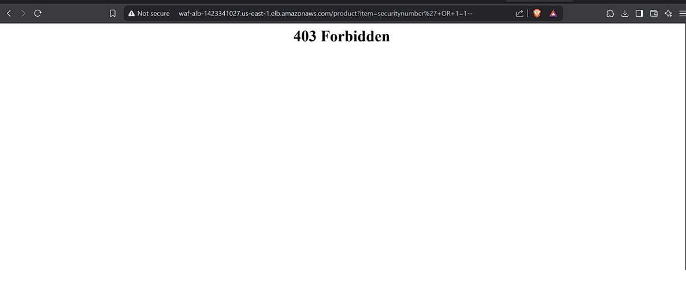

#  Enterprise-Grade Web Traffic Blocking using AWS WAF

##  Objective

To design and implement a secure, scalable, and enterprise-grade web traffic protection system using **AWS Web Application Firewall (WAF)**.  
This project demonstrates dynamic threat detection and mitigation through **managed rule sets**, **custom rules**, and **geo/IP filtering**, integrated with a real-time web architecture using **EC2 and Application Load Balancer (ALB)**.  
By simulating common cyber-attacks such as **SQL injection** and **query string tampering**, the objective is to showcase how AWS-native services can effectively block malicious traffic and enforce modern web security best practices in the cloud.

---

##  Steps

###  Step 1: Launch EC2 Instances to Host Websites

1. Go to **EC2 → Security Groups**  
   - Create a new security group allowing **SSH (port 22)** and **HTTP (port 80)**

2. Launch two EC2 instance:  
   - Name: `EC2-WebServer`  
   - AMI: Amazon Linux
.png)

   - User Data (optional): Custom HTML page

---

###  Step 2: Create Target Group & Application Load Balancer (ALB)

1. Go to **EC2 → Target Groups**
   - Target type: `Instances`
   - Health check path: `/index.html`
.png)
  - Register both EC2 instances

2. Go to **Load Balancers → Create Application Load Balancer**
   - Name: `WAF_ALB`
   - Select **all Availability Zones**
   - Use the security group from Step 1
   - Link to the previously created target group

3. Copy the **ALB DNS**, paste it in a browser.  
   - Refresh to see both websites alternating between requests

---

###  Step 3: Check for Vulnerabilities – SQL Injection & Query String

####  SQL Injection Test
- Open your Application Load Balancer (ALB) DNS in the browser and append the following string:
- To check SQL Injection, we add “/product?item=securitynumber’+OR+1=1--” to our ALB DNS.
- After entering we can see that its coming “Not Found” which indicates that our ALB is vulnerable to SQL Injection because it should come “403 Forbidden” in Safe case.
  

#### To check Query String, we add “/?admin=12345” to our ALB DNS.

